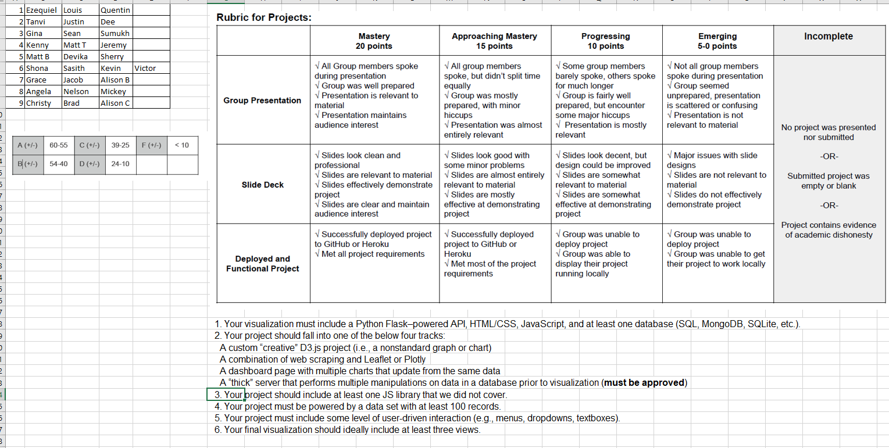

### Agriculture and Decreasing Biodiversity

**Developers:**
  - [Alison Beer]()
  - [Grace X]()
  - [Jacob Sussmilch]()

---

### Marking Rubric

---

### Resources

The Guardian: visualisations in this article are amazing!!!
  - https://www.theguardian.com/environment/ng-interactive/2019/oct/17/stripped-bare-australias-hidden-climate-crisis

Map showing the changes in vegetation extent in 75 Australian vegetation communities (as defined by the National Vegetation Information System 4.1) since 1750.
  - https://data.gov.au/dataset/ds-dga-b5f20e19-6354-457f-a7d6-f9ea174fdb49/details

Land clearing graphs
  - https://soe.environment.gov.au/theme/land/topic/2016/regional-and-landscape-scale-pressures-land-clearing#:~:text=Approximately%2044%20per%20cent%20of,vegetation%20communities%20(Figure%20LAN6).

d3 code for populating areas on map over time periods
  - https://observablehq.com/@mbostock/walmarts-growth

WWF Living Planet Report, this is amazing...check out the Ecological Footprint and biocapacity data tables on page 157+
  - https://www.worldwildlife.org/pages/living-planet-report-2014

D3 visualisation examples https://observablehq.com/@d3/gallery

Potential data sources:
  - https://www.footprintnetwork.org/resources/data/
  - http://www.environment.gov.au/about-us/environmental-information-data/open-data

Reference list for this report may provide a potential data source:
  - https://ipbes.net/pandemics